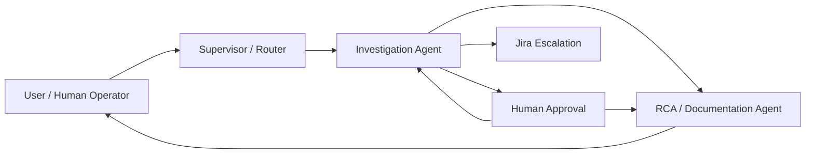
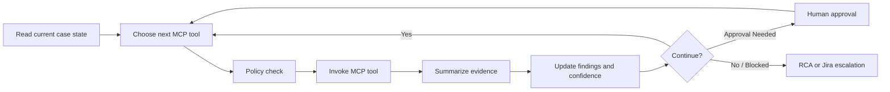
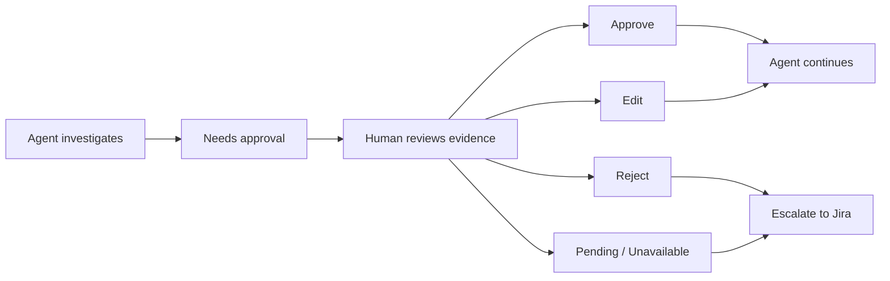
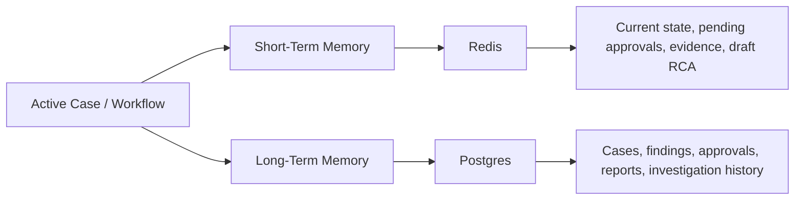
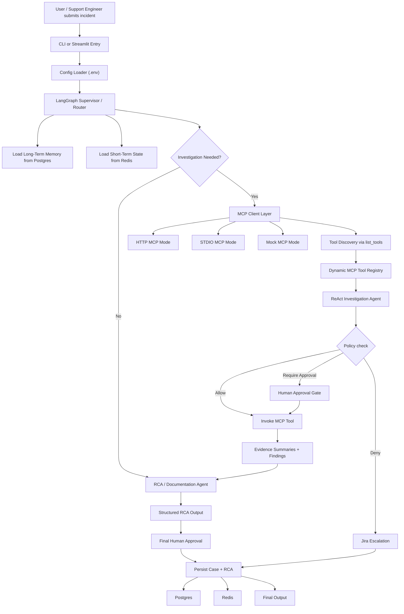

# Splunk MCP Multi-agent RCA Assistant

This project is an MVP prototype for enterprise incident root cause analysis, built around a multi-agent architecture that uses Splunk MCP, short-term and long-term memory, and human-in-the-loop decision making.

The project is built around a `LangGraph`-orchestrated multi-agent workflow with:

- `Splunk MCP` capability discovery and tool invocation
- `short-term memory` for active workflow state
- `long-term memory` for case history and RCA artifacts
- `strict HITL policy control` for approval-gated actions
- `structured RCA generation` and `Jira escalation`

---

## Start Here

Suggested reading order:

- [What This Project Is](#what-this-project-is)
- [Why Multi-Agent](#why-multi-agent)
- [Splunk MCP Capabilities](#splunk-mcp-capabilities)
- [Human-In-The-Loop (HITL)](#human-in-the-loop-hitl)
- [Memory Types](#memory-types)
- [How To Run](#how-to-run)
- [Sample Request Flow](#sample-request-flow)

---

## What This Project Is

This is a `LangGraph`-driven multi-agent incident investigation assistant that sits between:

- a `human operator`
- a `Splunk MCP server`
- a `short-term and long-term memory system`
- a `Jira escalation path`

The user submits an incident such as:

> "Payment API latency spike affecting checkout transactions with repeated timeouts."

The system then:

1. triages the issue
2. discovers available Splunk capabilities from MCP
3. investigates with a bounded ReAct-style flow
4. asks the human for approvals when policy requires it
5. drafts a structured RCA
6. stores the case history
7. escalates to Jira if the workflow gets blocked

---

## Project Shape

The project combines these major pieces in one workflow:

- `LangGraph-based multi-agent orchestration`
- `MCP-based tool discovery`
- `strict policy-controlled HITL`
- `short-term and long-term memory`
- `structured RCA generation`
- `Jira escalation for blocked cases`

---

## Why Multi-Agent

The project is intentionally split into multiple agents with separate responsibilities rather than using one monolithic prompt.



### Agent roles

`Supervisor / Router`

- owns triage
- classifies the incident
- decides whether investigation is needed
- loads recent memory context

`Investigation Agent`

- owns evidence gathering
- discovers MCP tools from the Splunk server
- chooses safe, scoped tools first
- records investigation steps and evidence summaries
- identifies likely causes with confidence

`RCA / Documentation Agent`

- owns the final narrative
- turns findings into structured RCA sections
- produces support-ready and escalation-ready output

`Human Operator`

- owns approvals and final judgment
- approves broad/sensitive actions
- approves, rejects, or edits final conclusions

`Jira Escalation Path`

- owns unresolved work
- activates when the workflow is blocked, denied, or missing approval

---

## Splunk MCP Capabilities

This project is MCP-native on the Splunk side.

Instead of assuming a fixed tool list, the app:

- connects to an MCP server
- discovers tools dynamically
- maps discovered tools into investigation roles
- enforces policy before invocation

### What that means

The workflow is designed so a team can point it at their own Splunk MCP integration and reuse the same agent flow, as long as the MCP server exposes tools in a recognizable way.

### Current transport support

`mock`

- local fake MCP client for demos and evals

`http`

- MCP-style API mode for servers exposed over HTTP

`stdio`

- command-driven integration such as `python splunk_mcp.py stdio`

### Current MCP target

The implementation is shaped to work well with [`livehybrid/splunk-mcp`](https://github.com/livehybrid/splunk-mcp).

### Canonical investigation roles

Discovered tools are mapped into roles such as:

- `tool_discovery`
- `alert_context`
- `recent_errors`
- `correlation_lookup`
- `broad_search`

That mapping gives the workflow a stable investigation model even when MCP tool names vary by environment.

---

## ReAct Investigation Loop

The investigation agent follows a bounded ReAct-style loop.

The ReAct flow involves the following:

- choose the next MCP tool based on the current state
- evaluate policy before invocation
- gather evidence from the tool call
- update findings and confidence
- stop when enough evidence exists, approval is required, or escalation is needed



This loop is intentionally bounded:

- it prefers scoped tools first
- it respects strict HITL policy
- it stops when confidence is too low or the next action is not allowed
- it escalates instead of continuing indefinitely

---

## Human-In-The-Loop (HITL)

Human approval is a core part of the design:



The human is involved in two main places:

- before broad or sensitive MCP actions
- before final RCA closure

The human can:

- approve
- reject
- edit
- remain unavailable / pending

### Strict policy control

HITL decisions are controlled by a central policy layer, not by agent preference.

Every discovered MCP tool is evaluated as one of:

- `allow`
- `require_approval`
- `deny`

Default strict policy:

- allow only safe read-oriented roles such as tool discovery, alert context, recent errors, and correlation lookup
- require approval for broad search roles such as `search_splunk`
- deny mutating or administrative tools by default
- require approval for unknown tools unless config changes that behavior to `deny`

If the workflow is blocked because:

- the agent is not authorized to continue
- a required action is rejected
- a human approver is unavailable
- the investigation cannot progress with enough confidence

then the system escalates to Jira with:

- current progress
- actions already taken
- approval history
- next steps

---

## Memory Types

The project uses two layers of memory.



### Short-Term Memory

Short-term memory is the active workflow state carried through LangGraph and stored in Redis for resumable execution.

It includes:

- current incident
- case status
- evidence collected so far
- investigation steps
- findings
- pending approvals
- draft RCA state

### Long-Term Memory

Long-term memory is durable case history stored in Postgres.

It includes:

- `cases`
- `investigation_steps`
- `findings`
- `approvals`
- `rca_reports`

This lets the system preserve case history and reuse recent incident context in future investigations.

---

## Agent Responsibilities

### 1. Supervisor / Router

Responsible for:

- reading the incoming issue
- classifying the request
- deciding whether investigation is needed
- loading recent similar cases from long-term memory
- initializing workflow state

### 2. Investigation Agent

Responsible for:

- discovering MCP tools from the Splunk server
- selecting allowed tools first
- requesting approval for policy-gated tools
- collecting evidence from Splunk
- recording investigation steps
- summarizing evidence
- identifying likely causes

It does not expose hidden chain-of-thought to the user. It stores concise investigation artifacts instead.

### 3. RCA / Documentation Agent

Responsible for generating:

- `Summary of issue`
- `Issue Breakdown`
- `Actions Taken`
- `Human approvals`
- `Next Steps`

It also produces likely cause, confidence, and escalation-ready documentation.

### 4. Human Operator

Interacts with the agent through the Streamlit chat UI.

The human can:

- submit a case
- review investigation progress
- approve/reject actions
- edit the final conclusion
- leave approval pending

### 5. Jira Escalation

Creates a Jira issue containing:

- incident summary
- issue breakdown
- actions taken
- human approval history
- next steps
- blocked reason

---

## Architecture



---

## How To Run

### Prerequisites

- Python `3.11+`
- Postgres
- Redis
- optional OpenAI-compatible model credentials
- optional Jira credentials
- optional Splunk MCP server in `http` or `stdio` mode

### Install

```bash
python3.11 -m venv .venv
source .venv/bin/activate
pip install -e .[dev]
cp .env.example .env
```

### Configure `.env`

The project uses one single `.env` file for runtime configuration.

Core runtime values:

- `OPENAI_API_KEY`
- `OPENAI_MODEL`
- `OPENAI_BASE_URL`
- `POSTGRES_DSN`
- `REDIS_URL`
- `SPLUNK_ADAPTER_MODE=mock|http|stdio`
- `SPLUNK_MCP_BASE_URL`
- `SPLUNK_MCP_API_KEY`
- `SPLUNK_MCP_STDIO_COMMAND`

Strict HITL policy values:

- `MCP_ALLOW_ROLES`
- `MCP_APPROVAL_REQUIRED_ROLES`
- `MCP_DENY_ROLES`
- `MCP_ALLOW_TOOL_NAMES`
- `MCP_APPROVAL_REQUIRED_TOOL_NAMES`
- `MCP_DENY_TOOL_NAMES`
- `MCP_DENY_TOOL_NAME_PATTERNS`
- `MCP_UNKNOWN_TOOL_POLICY`

Escalation values:

- `JIRA_ENABLED`
- `JIRA_BASE_URL`
- `JIRA_EMAIL`
- `JIRA_API_TOKEN`
- `JIRA_PROJECT_KEY`
- `JIRA_ISSUE_TYPE`

### Run From The CLI

```bash
python -m app.main "Payment API latency spike affecting checkout transactions with repeated timeouts." \
  --service-name payment-service \
  --severity high \
  --correlation-id corr-payment-001 \
  --alert-id alert-payment-latency \
  --non-interactive
```

### Run The Streamlit UI

```bash
streamlit run app/streamlit_app.py
```

The Streamlit UI is the simplest human-agent interface:

- human sends the incident in chat
- agent investigates and reports progress in chat
- agent pauses and asks for approvals in chat
- human responds with `approve`, `reject`, `pending`, or `edit: ...`
- agent finalizes the RCA or escalates to Jira

---

## Sample Request Flow

Example request:

> "Payment API latency spike affecting checkout transactions with repeated timeouts."

### End-to-end walkthrough

1. Human submits the incident through CLI or Streamlit.
2. Supervisor classifies it as a performance or dependency-related issue.
3. The workflow loads recent memory and initializes a case.
4. The investigation agent connects to the Splunk MCP server.
5. The MCP client discovers available tools via tool discovery.
6. The policy layer evaluates each tool before invocation.
7. The agent selects scoped tools first, such as alert context, recent errors, or correlation lookup.
8. If the next tool is policy-gated, such as `search_splunk`, the agent asks the human for approval.
9. The human approves, rejects, edits, or leaves the request pending.
10. The RCA/documentation agent drafts:
    - Summary of issue
    - Issue Breakdown
    - Actions Taken
    - Human approvals
    - Next Steps
11. The human reviews the final RCA.
12. If approved, the workflow stores the final RCA and closes the case.
13. If blocked or disapproved, the workflow creates a Jira ticket and stores the escalation state.

### What the reader should notice

- the agent does not own policy
- MCP capability discovery is dynamic
- memory is preserved during and after the run
- the human is part of the control loop
- the workflow produces operational artifacts, not just chat text

---

## Example Output

```json
{
  "case_id": "case-7a93c5e2e1b1",
  "summary_of_issue": "Incident for payment-service classified as performance_or_dependency. Current likely cause: The incident is most consistent with downstream database contention or timeouts impacting the service. with confidence 0.88.",
  "issue_breakdown": [
    "User issue: Payment API latency spike affecting checkout transactions with repeated timeouts.",
    "Severity: high",
    "Environment: production",
    "Primary service: payment-service",
    "Finding category: dependency_timeout"
  ],
  "actions_taken": [
    "Step 1: summarize_alert_context -> Payment API latency spike: Payment transactions exceeded the p95 latency SLO for 12 minutes.",
    "Step 2: get_recent_errors -> get_recent_errors returned 2 event(s); representative evidence: Upstream database timeout while processing charge request"
  ],
  "human_approvals": [
    "final approval: auto_approved"
  ],
  "next_steps": [
    "Inspect database health and connection pool saturation on the affected dependency.",
    "Throttle or queue non-critical traffic while dependency latency recovers.",
    "Review recent deploys or workload spikes affecting the downstream system."
  ],
  "issue_summary": "Payment API latency spike affecting checkout transactions with repeated timeouts.",
  "likely_cause": "The incident is most consistent with downstream database contention or timeouts impacting the service.",
  "confidence_level": 0.88,
  "human_approval_status": "auto_approved",
  "status": "closed",
  "jira_ticket_key": null
}
```